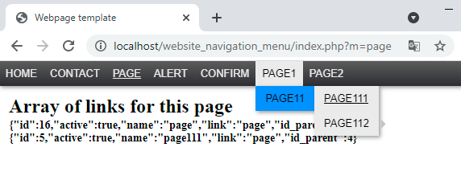

# easy_navigation_menu
So this is kind of classic navigation bar to easy use

## Purpose
The Purposeof this project is to add a php module with navigation bar 
    to your website easily and quickly.

## Technologies
<ul>
    <li>PHP v7.0</li>
    <li>JQuery v1.12.4</li>
    <li>JQueryUI v1.12.1</li>
    <li>CSS/SASS</li>
</ul>

## Usag
Download this complete website template.  
In the index.php file you will see how I added the NAV module.

## License

The MIT License (MIT). Please see [License File](LICENSE) for more information.

